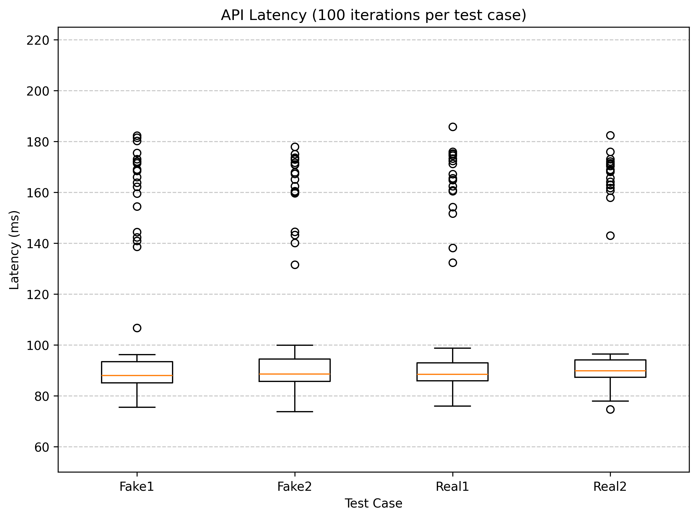

# Fake News Detection ML Application
A Flask app for fake news classification using a Naive Bayes approach deployed using AWS Elastic Beanstalk.

#### Domain
http://fakenewsml-env.eba-3zhcmbjj.us-east-2.elasticbeanstalk.com/

#### Project Structure

```
fake-news-ml/
├── model/
│   ├── basic_classifier.pkl
│   └── count_vectorizer.pkl
├── test_results/
│   ├── fake1_latencies.csv
│   ├── fake2_latencies.csv
│   ├── real1_latencies.csv
│   ├── real2_latencies.csv
│   └── latency_boxplot.png
├── application.py
├── requirements.txt
├── Procfile
└── readme.md
```

#### Average Latency Results
| Test Case | Average Latency (ms) |
|-----------|----------------------|
| Fake  1 | 101.57                |
| Fake  2 | 102.72                |
| Real  1 | 102.02                |
| Real  2 | 104.08                |

#### Boxplot of Latencies (_showing outliers_)

